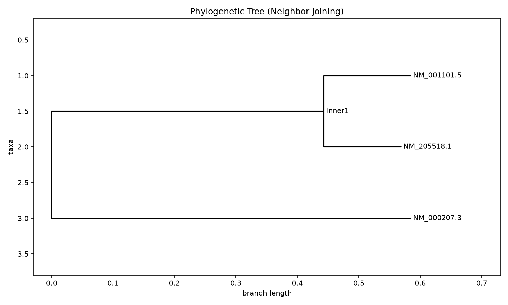

# Phylogenetic Tree Builder

## Overview
A Python tool that takes a set of DNA sequences and builds a phylogenetic tree showing their evolutionary relationships, using pairwise sequence alignment and Neighbor-Joining tree construction.

## Motivation
Built as a follow-on from my COVID-19 variant sequence analyser — instead of just detecting mutations between sequences, this project visualizes how multiple variants relate to one another evolutionarily. Understanding lineage relationships is a core task in genomic surveillance (e.g. tracking how SARS-CoV-2 variants diverged from the original Wuhan strain).

## Tech Stack
- **Language:** Python 3
- **Libraries:** Biopython (`Bio.Align`, `Bio.Phylo`), Matplotlib
- **Data source:** NCBI GenBank (via Entrez API), or any FASTA file

## How It Works
1. Load DNA sequences from a FASTA file
2. Perform pairwise global alignment between every pair of sequences (`Bio.Align.PairwiseAligner`)
3. Convert alignment scores into genetic distances (0 = identical, 1 = maximally different)
4. Build a distance matrix from all pairwise comparisons
5. Construct a tree using the **Neighbor-Joining** algorithm
6. Root the tree at its midpoint and render it as both an image and a Newick file (the standard format used by phylogenetics tools like iTOL and FigTree)

## Results
Run on 6 synthetic SARS-CoV-2-style variant sequences (a reference genome plus 5 variants with increasing numbers of simulated mutations), the tool correctly recovers the expected structure: variants with more mutations relative to the reference branch off further, and the tree groups them by genetic similarity.



## What I'd Improve
1. Swap the simple pairwise-alignment distance metric for a proper multiple sequence alignment (MSA) via a tool like MUSCLE or Clustal Omega, which is more standard for larger sequence sets
2. Add bootstrap support values to assess confidence in the tree topology
3. Add a command-line interface so sequences/output paths can be specified without editing the script

## How to Run

```bash
git clone <your-repo-url>
cd phylogenetic-tree-builder
pip install -r requirements.txt

# Option A: use the included demo data
python build_tree.py

# Option B: fetch your own sequences from NCBI first
# (edit the accession list and email in fetch_sequences.py)
python fetch_sequences.py
python build_tree.py
```

Output is saved to `output/tree.png` (visual) and `output/tree.newick` (for use in other phylogenetics software).

## Note on the included data
`data/sample_sequences.fasta` contains **synthetic** sequences generated by introducing random mutations into a real SARS-CoV-2 reference genome, purely to demonstrate the pipeline. For real analysis, use `fetch_sequences.py` to pull actual sequences from NCBI GenBank.
